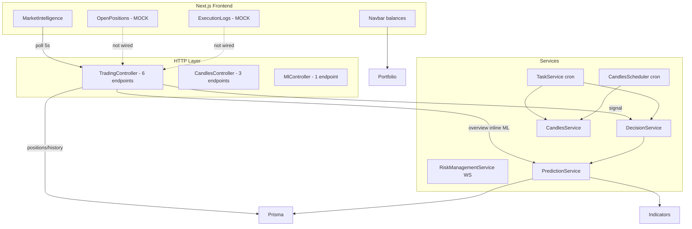
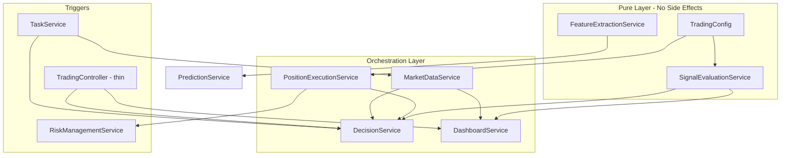

# Trading Engine Architecture Audit & Refactoring Plan

## Executive Summary

Your suspicion is correct. The codebase has accrued meaningful technical debt across four areas: **duplicated ML signal evaluation**, **controller-heavy orchestration**, **redundant candle-sync entry points**, and **orphaned endpoints/DTOs**. The dashboard works because `GET /api/trading/overview` re-implements the same 0.4% threshold that `DecisionService` uses for trade execution — but without wallet/position gates, so the two paths can diverge silently.

---

## Current Architecture



---

## Finding 1: Endpoint Redundancy

### ML signal paths (3 overlapping routes)

| Endpoint                          | Mutates DB?                      | ML Logic                             | Used by Frontend? |
| --------------------------------- | -------------------------------- | ------------------------------------ | ----------------- |
| `GET /api/trading/overview`       | No                               | Inline in controller (lines 149–161) | **Yes** (5s poll) |
| `GET /api/trading/signal?symbol=` | **Yes** (opens/closes positions) | `DecisionService.evaluateSignal`     | No                |
| `GET /api/ml/predict?symbol=`     | No                               | `PredictionService` raw output       | No                |

**Problem:** Overview and execution share the same 0.4% threshold but live in different files. Overview shows `BUY` even when execution would return `HOLD` (insufficient balance, position already open). Worse: `GET /signal` is a state-mutating endpoint using the HTTP GET verb.

### Candle sync paths (5 entry points, same `syncCandles` call)

| Trigger                      | File                                                                            | Symbol scope         | Limit         |
| ---------------------------- | ------------------------------------------------------------------------------- | -------------------- | ------------- |
| Cron `:05` every 15 min      | `[task.service.ts](apps/backend/src/modules/trading/task/task.service.ts)`      | All active markets   | 100 (default) |
| Cron `:05` every 15 min      | `[candles.scheduler.ts](apps/backend/src/modules/candles/candles.scheduler.ts)` | Hardcoded `SOL/USDT` | 5             |
| `POST /api/candles/sync`     | CandlesController                                                               | Manual               | configurable  |
| `POST /api/candles/backfill` | CandlesController                                                               | Manual               | 1000 default  |
| `POST /api/trading/market`   | TradingController                                                               | On market add        | 1000          |

If `SOL/USDT` is an active market, it is synced **twice** per cron cycle.

---

## Finding 2: Code Duplication

### ML signal evaluation (highest priority)

**Controller (display-only):**

```149:161:apps/backend/src/modules/trading/trading.controller.ts
      try {
          const prediction = await this.predictionService.predictNextCandle(market.symbol);
          const currentPrice = prediction.current_price;
          const predictedPrice = prediction.predicted_next_price;

          if (currentPrice && predictedPrice) {
              const priceChangePct = ((predictedPrice - currentPrice) / currentPrice) * 100;

              if (priceChangePct > 0.4) mlSignal = 'BUY';
              else if (priceChangePct < -0.4) mlSignal = 'SELL';

              confidence = Math.abs(Number(priceChangePct.toFixed(2)));
          }
```

**DecisionService (execution):**

```9:12:apps/backend/src/modules/trading/decision/decision.service.ts
    private readonly FEE_PER_TRADE_PCT = 0.1;
    private readonly ROUND_TRIP_FEE_PCT = this.FEE_PER_TRADE_PCT * 2;
    private readonly MIN_NET_PROFI_PCT = 0.2;
    private readonly MIN_PRICE_MOVEMENT_PCT = this.ROUND_TRIP_FEE_PCT + this.MIN_NET_PROFI_PCT;
```

Same 0.4% magic number, different homes. The controller hardcodes `0.4`; the service derives it from fee constants.

### Position close transaction (DecisionService vs RiskManagementService)

Both `[decision.service.ts](apps/backend/src/modules/trading/decision/decision.service.ts)` (lines 108–128) and `[risk-management.service.ts](apps/backend/src/modules/trading/risk-management/risk-management.service.ts)` (lines 134–168) contain identical:

- `grossPnL` / `netPnL` math
- `ROUND_TRIP_FEE_PCT = 0.2` (hardcoded in RMS, derived in DecisionService)
- Prisma `$transaction`: delete position → unlock wallet → (RMS also writes `tradeSimulation`)

### Feature extraction (CandlesService vs PredictionService)

| Aspect       | `CandlesService.getTechnicalFeatures` | `PredictionService.predictNextCandle`   |
| ------------ | ------------------------------------- | --------------------------------------- |
| Candle query | 100 rows DESC, reversed               | 500 rows ASC                            |
| Min data     | 35 candles                            | 50 candles                              |
| Indicators   | RSI, MACD, **EMA**                    | RSI, MACD only                          |
| Used by      | `GET /api/candles/features` (unused)  | Overview, DecisionService, MlController |

`PredictionService` bypasses `CandlesService` and queries Prisma directly.

---

## Finding 3: Separation of Concerns Violations

`[trading.controller.ts](apps/backend/src/modules/trading/trading.controller.ts)` injects **5 dependencies** and contains business logic in 4 of 6 handlers:

| Handler                | Logic location                 | Lines of concern                                   |
| ---------------------- | ------------------------------ | -------------------------------------------------- |
| `getDashboardOverview` | Controller                     | Ticker fetch, ML call, threshold eval, aggregation |
| `getActivePositions`   | Controller                     | Per-position candle lookup, PnL calc               |
| `addMarket`            | Controller                     | Validation, Prisma create, async backfill          |
| `getTradeHistory`      | Controller                     | Prisma query + mapping                             |
| `getSignal`            | Delegates to `DecisionService` | Correct pattern                                    |
| `getMarket`            | Direct Prisma                  | Minor                                              |

Only `getSignal` follows the thin-controller pattern.

**Additional bugs found during audit:**

- Line 70: `error.messaqe` typo + stray `3` character (compile error)
- `getActivePositions` line 93: mixes `Number(pos.entryPrice)` with raw `pos.entryPrice` in PnL division
- `TaskService` hardcodes `'15m'` ignoring `market.timeframe` from schema
- `Candle` model has no `timeframe` column — multi-timeframe markets would collide

---

## Finding 4: Dead / Unused Code

### Backend endpoints with zero frontend consumers

| Endpoint                     | Status                                                  |
| ---------------------------- | ------------------------------------------------------- |
| `GET /api/trading/signal`    | Orphaned (mutating GET)                                 |
| `GET /api/trading/market`    | Orphaned                                                |
| `POST /api/trading/market`   | Orphaned (admin-only via Swagger)                       |
| `GET /api/trading/positions` | Backend ready; frontend uses mocks                      |
| `GET /api/trading/history`   | Backend ready; frontend uses mocks                      |
| `POST /api/candles/sync`     | Orphaned (admin/dev tool)                               |
| `POST /api/candles/backfill` | Orphaned (thin wrapper over sync)                       |
| `GET /api/candles/features`  | Orphaned                                                |
| `GET /api/ml/predict`        | Orphaned (overview calls PredictionService server-side) |

**Frontend only calls 2 endpoints:** `GET /api/trading/overview` and `GET /api/portfolio/balances`.

### Unused DTOs

- `[active-position.dto.ts](apps/backend/src/modules/trading/dto/active-position.dto.ts)` — never imported
- `[trade-history.dto.ts](apps/backend/src/modules/trading/dto/trade-history.dto.ts)` — never imported

### Other dead code

- `CandlesScheduler` — redundant with `TaskService`; wrong logger name (`CandlesService.name`)
- `Sentiment` Prisma model — no backend references
- `DecisionService` exported from module but consumed only within TradingModule
- `ActivePosition.amount` duplicates `coinQuantity` (both set to same value on BUY)

---

## Target Architecture



**Key principle:** `SignalEvaluationService` is a **pure function service** — it takes prediction data (+ optional position/wallet context) and returns a signal decision. It never touches the database. Both `DashboardService` (read-only) and `DecisionService` (mutating) consume it.

---

## Step-by-Step Refactoring Plan

### Phase 0 — Hotfixes (no structural change)

Fix before refactoring to keep the app compiling and correct:

1. Fix syntax error on `[trading.controller.ts:70](apps/backend/src/modules/trading/trading.controller.ts)` (`error.message`, remove stray `3`)
2. Fix PnL coercion bug in `getActivePositions` (use `Number(pos.entryPrice)` consistently)
3. Fix typo `MIN_NET_PROFI_PCT` → `MIN_NET_PROFIT_PCT` in DecisionService

### Phase 1 — Extract `TradingConfig`

Create `[apps/backend/src/modules/trading/config/trading.config.ts](apps/backend/src/modules/trading/config/trading.config.ts)`:

```typescript
export const TRADING_CONFIG = {
  FEE_PER_TRADE_PCT: 0.1,
  ROUND_TRIP_FEE_PCT: 0.2, // derived: FEE * 2
  MIN_NET_PROFIT_PCT: 0.2,
  MIN_PRICE_MOVEMENT_PCT: 0.4, // ROUND_TRIP + MIN_NET
  STOP_LOSS_PCT: 0.02,
  TAKE_PROFIT_PCT: 0.04,
  ALLOCATION_PCT: 0.05,
  MIN_TRADE_AMOUNT: 10.0,
} as const;
```

Replace all hardcoded `0.4`, `0.2`, `0.02`, `0.04` across DecisionService, RiskManagementService, and the controller.

### Phase 2 — Extract `SignalEvaluationService` (core goal)

Create `[apps/backend/src/modules/trading/signal/signal-evaluation.service.ts](apps/backend/src/modules/trading/signal/signal-evaluation.service.ts)`:

```typescript
interface MlPrediction {
  current_price: number;
  predicted_next_price: number;
}

interface DisplaySignal {
  signal: 'BUY' | 'SELL' | 'HOLD';
  confidence: number;
  priceChangePct: number;
}

interface ExecutionDecision {
  action: 'BUY' | 'SELL' | 'HOLD';
  reason: string;
  priceChangePct: number;
}

// Pure methods — no Prisma, no HTTP
computePriceChangePct(prediction: MlPrediction): number
evaluateDisplaySignal(prediction: MlPrediction): DisplaySignal
evaluateExecutionDecision(
  prediction: MlPrediction,
  context: { hasOpenPosition: boolean; walletBalance: number; quoteAsset: string }
): ExecutionDecision
```

- `evaluateDisplaySignal` — threshold check only (replaces controller inline logic)
- `evaluateExecutionDecision` — threshold + wallet/position gates (replaces DecisionService lines 46–133 decision logic, **not** the DB writes)

Register in TradingModule. Write unit tests for edge cases (exactly 0.4%, negative balance, position already open).

### Phase 3 — Extract `PositionExecutionService`

Create `[apps/backend/src/modules/trading/execution/position-execution.service.ts](apps/backend/src/modules/trading/execution/position-execution.service.ts)`:

```typescript
openPosition(symbol, currentPrice, tradeAmount, quoteAsset): Promise<void>
closePosition(symbol, currentPrice, quoteAsset, metadata): Promise<{ netPnL, netProfitUsdt }>
```

Consolidates the duplicated `$transaction` blocks from DecisionService (BUY/SELL) and RiskManagementService (SL/TP). Both callers pass different `metadata` for `tradeSimulation`.

### Phase 4 — Slim `DecisionService`

Refactor `[decision.service.ts](apps/backend/src/modules/trading/decision/decision.service.ts)` to:

1. Call `PredictionService.predictNextCandle(symbol)`
2. Load position + wallet from Prisma
3. Call `SignalEvaluationService.evaluateExecutionDecision(prediction, context)`
4. If action is BUY/SELL, delegate to `PositionExecutionService`
5. Log to `tradeSimulation`

DecisionService becomes a thin orchestrator (~40 lines vs current 162).

### Phase 5 — Extract `DashboardService`

Create `[apps/backend/src/modules/trading/dashboard/dashboard.service.ts](apps/backend/src/modules/trading/dashboard/dashboard.service.ts)`:

```typescript
async getOverview(): Promise<OverviewItem[]>
```

Moves all logic from `getDashboardOverview` out of the controller:

- Load active markets from Prisma
- Per market: `ExchangeService.fetchTicker` + `PredictionService.predictNextCandle`
- Per market: `SignalEvaluationService.evaluateDisplaySignal(prediction)`
- Return aggregated `{ data: overview }`

Controller becomes: `return this.dashboardService.getOverview()`.

### Phase 6 — Consolidate candle sync

1. **Remove `CandlesScheduler`** — `TaskService` already syncs all active markets on the same cron schedule
2. Update `TaskService` to use `market.timeframe` instead of hardcoded `'15m'`:

```typescript
await this.candlesService.syncCandles(market.symbol, market.timeframe);
```

1. Keep `POST /api/candles/sync` and `POST /api/candles/backfill` as admin/dev tools (document in Swagger), but consider merging backfill into sync with a `limit` param (backfill is a thin wrapper today)
2. **Future (separate PR):** Add `timeframe` column to `Candle` model and update unique constraint to `[symbol, timeframe, timestamp]`

### Phase 7 — Unify feature extraction

Create `[apps/backend/src/modules/candles/feature-extraction.service.ts](apps/backend/src/modules/candles/feature-extraction.service.ts)`:

- Single method: `buildFeatureMatrix(symbol, options?)` returning `{ closePrices, datasetX, datasetY, currentFeatures }`
- Refactor `PredictionService` to call this instead of direct Prisma + indicator loops
- Refactor `CandlesService.getTechnicalFeatures` to call the same service (with smaller window)
- Eliminates the 100-vs-500 candle query inconsistency

### Phase 8 — Endpoint cleanup

| Action           | Endpoint                                                       | Rationale                                                                           |
| ---------------- | -------------------------------------------------------------- | ----------------------------------------------------------------------------------- |
| **Keep**         | `GET /api/trading/overview`                                    | Frontend depends on it                                                              |
| **Keep**         | `GET /api/trading/positions`                                   | Ready to wire frontend                                                              |
| **Keep**         | `GET /api/trading/history`                                     | Ready to wire frontend                                                              |
| **Keep**         | `POST /api/trading/market`                                     | Market registry (admin)                                                             |
| **Keep**         | `GET /api/trading/market`                                      | Market registry (admin)                                                             |
| **Change**       | `GET /api/trading/signal` → `POST /api/trading/signal/execute` | Mutations must not use GET                                                          |
| **Add**          | `GET /api/trading/signal/preview?symbol=`                      | Read-only signal (uses `evaluateDisplaySignal` + position context)                  |
| **Deprecate**    | `GET /api/ml/predict`                                          | Redundant with preview; keep for dev debugging with `@ApiExcludeEndpoint` or remove |
| **Keep (admin)** | `POST /api/candles/sync`, `POST /api/candles/backfill`         | Dev/ops tools                                                                       |
| **Deprecate**    | `GET /api/candles/features`                                    | Subsumed by unified feature extraction; or keep as debug endpoint                   |

### Phase 9 — Extract query services (thin controller goal)

Move remaining controller Prisma logic:

| New Service            | Absorbs                    |
| ---------------------- | -------------------------- |
| `PositionQueryService` | `getActivePositions` logic |
| `TradeHistoryService`  | `getTradeHistory` logic    |
| `MarketConfigService`  | `getMarket`, `addMarket`   |

Final controller shape (all handlers ≤ 3 lines):

```typescript
@Get('overview')  getOverview()       { return this.dashboardService.getOverview(); }
@Get('positions') getPositions()      { return this.positionQueryService.getActiveWithPnl(); }
@Get('history')   getHistory()        { return this.tradeHistoryService.getRecent(100); }
@Post('signal/execute') execute(@Query() q) { return this.decisionService.evaluateSignal(q.symbol); }
@Get('signal/preview')  preview(@Query() q) { return this.dashboardService.getSignalPreview(q.symbol); }
```

### Phase 10 — Frontend wiring (separate PR, after backend stabilizes)

1. Create `get-positions.ts` + `use-positions.ts` → wire `[OpenPositions.tsx](apps/frontend/src/features/trading/components/OpenPositions.tsx)` to `GET /api/trading/positions`
2. Create `get-trade-history.ts` + `use-trade-history.ts` → wire `[ExecutionLogs.tsx](apps/frontend/src/features/trading/components/ExecutionLogs.tsx)` to `GET /api/trading/history`
3. Align frontend types in `[types/index.ts](apps/frontend/src/features/trading/types/index.ts)` with actual API response shapes
4. Remove `MOCK_POSITIONS` and `MOCK_LOGS`

### Phase 11 — Dead code removal

- Delete unused DTOs (`active-position.dto.ts`, `trade-history.dto.ts`) or wire them with `@ApiOkResponse`
- Remove `CandlesScheduler` and its provider registration
- Remove `Sentiment` model from schema (or implement it — currently zero usage)
- Remove duplicate `ActivePosition.amount` field (migration to drop column)

---

## Dependency / Module Changes

```
TradingModule
├── imports: MlModule, DatabaseModule, CandlesModule
├── providers (new):
│   ├── TradingConfig (or plain exported const)
│   ├── SignalEvaluationService      ← pure, testable
│   ├── PositionExecutionService     ← DB mutations only
│   ├── DashboardService             ← read-only orchestration
│   ├── PositionQueryService
│   ├── TradeHistoryService
│   └── MarketConfigService
├── providers (existing, refactored):
│   ├── DecisionService              ← thin orchestrator
│   ├── TaskService                  ← uses market.timeframe
│   └── RiskManagementService        ← uses PositionExecutionService
└── exports: SignalEvaluationService (if MlModule ever needs it)

CandlesModule
├── providers (new):
│   └── FeatureExtractionService
├── providers (removed):
│   └── CandlesScheduler
└── exports: + FeatureExtractionService
```

---

## Risk Mitigation

| Risk                                                   | Mitigation                                                                                                         |
| ------------------------------------------------------ | ------------------------------------------------------------------------------------------------------------------ |
| Overview and execution signals diverge during refactor | Phase 2 unit tests on `SignalEvaluationService`; both paths must import same service before any controller changes |
| Cron job breaks during DecisionService refactor        | Phase 4 keeps `evaluateSignal` signature identical; only internal implementation changes                           |
| Double-sync removal breaks SOL/USDT data               | `TaskService` already syncs all active markets including SOL/USDT; verify in staging before removing scheduler     |
| Frontend breaks on overview response shape             | Phase 5 preserves exact `{ data: [...] }` response contract; no frontend changes needed until Phase 10             |
| `GET /signal` consumers break on verb change           | No frontend consumers exist; safe to change to POST                                                                |

---

## Recommended Execution Order

Phases 0–2 are safe, isolated, and deliver the highest value (centralized ML logic). Phases 3–5 complete the backend refactor. Phases 6–8 are cleanup. Phases 9–11 are polish and frontend integration.

**Minimum viable refactor (if scope must be limited):** Phases 0 + 1 + 2 + 4 + 5. This centralizes ML evaluation and removes controller duplication without touching candle sync or frontend.
